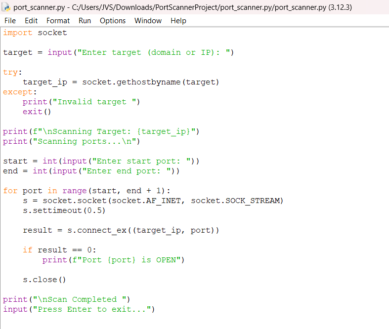
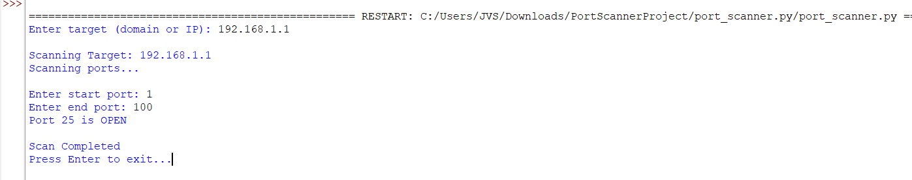

# python-port-scanner

## Project Description
This project is a simple port scanner developed using Python. It scans a target IP address or domain and identifies open ports using socket programming.

## Features
- Accepts domain or IP address
- Scans custom port range
- Displays open ports

##  Technologies Used
- Python
- Socket Programming

##  Screenshots

### 🔹 Code


### 🔹 Output


##  How to Run
```bash
python port_scanner.py
